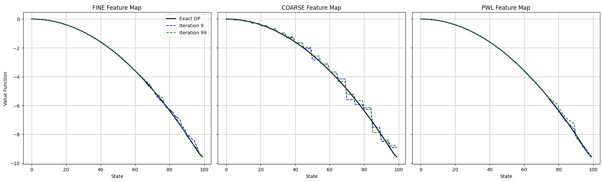
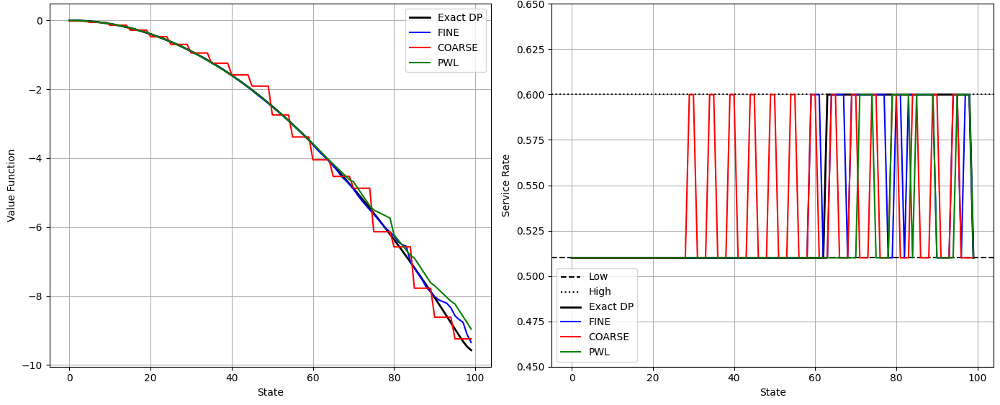
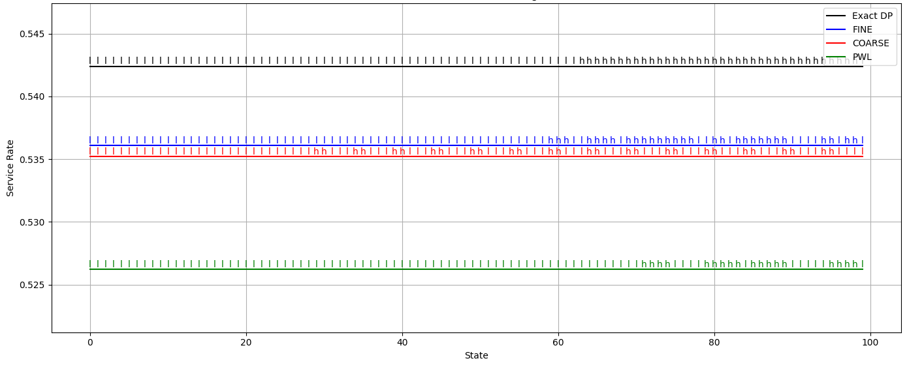

# Exploring Feature Encoding Impact on Temporal Difference Learning

## Overview

This repository showcases how different feature encoding strategies affect the learning of value functions when using Approximate Policy Iteration (API) with Least-Squares Temporal Difference (LSTD). The project highlights practical RL techniques and their outcomes under varying state representations, in our case we will simulate a queue management system.

## Setup

- **Environment**: Queue length $N=100$, arrival rate $p=0.5$, service rates $q_{\text{low}}=0.51$, $q_{\text{high}}=0.6$, costs $c_{\text{low}}=0$, $c_{\text{high}}=0.01$, discount factor $\gamma=0.9$.
- **Encodings**: 
  - Fine: N-dimensional one-hot encoding.
  - Coarse: N/5-dimensional grouped encoding.
  - PWL: 2N/5-dimensional piecewise linear encoding.

## Approach

- Implemented API with LSTD over 100 iterations, starting from a lazy policy.
- Tracked value functions at iterations 9 and 99 to assess convergence.
- Compared final policies and value functions to an optimal benchmark.

## Key Insights

- **Fine Encoding**: Offers the closest approximation to the optimal value function, with smooth convergence by iteration 99.
- **Coarse Encoding**: Shows instability and larger deviations, limiting accuracy.
- **PWL Encoding**: Falls between Fine and Coarse, with moderate performance.
- Convergence varies significantly with encoding strategy, impacting policy effectiveness.

## Limitations

- Results based on a single queue setup; performance may differ with other parameters.
- Fixed iteration count (100) might not ensure full convergence in all cases.

## File Description
- `Encoding_Impact.ipynb`: Jupyter Notebook with code, visualizations, and analysis.
